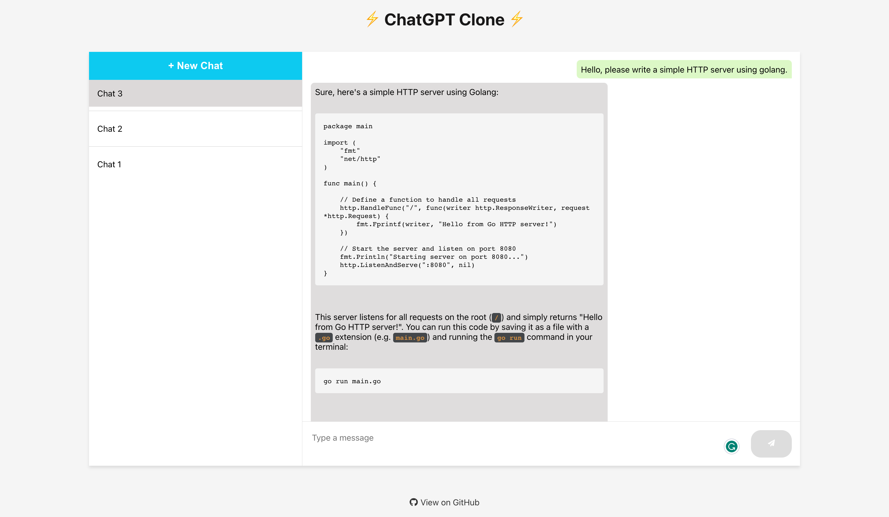

# 🤖 Self Hosted ChatGPT Clone

ChatGPT Clone: Self Hosted, Full-Stack Conversational AI Platform powered by React, Django REST Framework, and PostgreSQL and OpenAI's GPT-3.5 API. Most of the code is written by [GPT-4 model](https://openai.com/product/gpt-4). 

<p align="center">

</p>

## 📖 Table of Contents

- [Features](#-features)
- [Prerequisites](#-prerequisites)
- [Quick Start (Recommended)](#-quick-start-recommended)
- [Installation (Manual)](#-installation-manual)
- [Development (Contributing)](#-development-contributing)
- [Known Issues](#-known-issues)
- [Troubleshooting and FAQ](#-troubleshooting-and-faq)
- [Credits](#-credits)
- [License](#-license)

## 🚀 Features

- **Self Hosted**: You can host the project on your own server or local machine. All the data and OpenAI API Key are stored on your server.
- **Full-Stack**: The project is a full-stack project that includes a React frontend, Django REST Framework backend, and PostgreSQL database.
- **Conversational AI**: The project uses OpenAI's GPT-3.5 API to generate responses to user inputs.
- **Docker Compose**: The project uses Docker Compose to run the project in containers.
- **Django Admin Panel**: The project includes a Django Admin Panel to manage the project.
- **Supported OS**: The project is tested on Ubuntu and MacOS.


## 🛠 Prerequisites

- [Docker](https://docs.docker.com/get-docker/)
- [Docker Compose](https://docs.docker.com/compose/install/)
- [OpenAI API Key](https://platform.openai.com/account/api-keys)

## ⚡️ Quick Start (Recommended)

You can quickly deploy ChatGPT Clone by running the following command. This script ask you for your OpenAI API Key. Your OpenAI API Key is only stored in your `.envs/.env` file and is never sent to any other server. Please check the [install.sh](./install.sh) file to see what it does.

This script clones the project to your `$HOME` directory, updates the `.envs/.env` file with your OpenAI API Key, and runs the project in Docker Compose.

```bash
curl -sSL https://raw.githubusercontent.com/fatihbaltaci/chatgpt-clone/main/install.sh | bash
```

## 🔧 Installation (Manual)

### Clone the Repository

```bash
git clone https://github.com/fatihbaltaci/chatgpt-clone.git
cd chatgpt-clone
```

### Update .env File

Update the `OPENAI_API_KEY` key in the [.envs/.env](.envs/.env) file with your OpenAI API Key. You can also update the other environment variables in this file.

### 🚀 Run the Project

```bash
docker-compose build
docker-compose up -d
```

### 🌐 Access the Project

The project will be available at http://localhost:3090/

### 🧐 Access the Django Admin Panel

The admin panel will be available at http://localhost:3090/admin/ and you can login with the superuser credentials you set in the [.envs/.env](.envs/.env) file.

### 🧹 Clean Up

If you installed the project using the [install.sh](./install.sh) script, you must first change the directory to the `$HOME/chatgpt-clone` directory before running the commands below.

```bash
cd $HOME/chatgpt-clone
docker-compose down
```

(Optional) Delete Postgres Volume (Warning: This will delete all data in the database)

```bash
docker volume rm chatgpt-clone_postgres
```

## 🛠 Development (Contributing)

If you want to contribute to this project, you can follow the instructions below to set up a development environment.
## Backend

### Create Postgres

Docker is required to run the Postgres database. If you don't have Docker installed, you can install it from [here](https://docs.docker.com/get-docker/).

```bash
POSTGRES_VERSION=13.6
POSTGRES_PASSWORD=changeme
docker run -d --name chatgptpostgres \
    -e POSTGRES_PASSWORD=$POSTGRES_PASSWORD \
    -p 5532:5432 \
    --hostname chatgptpostgres \
    --restart always \
    -v $HOME/BACKUP/chatgptpostgres:/var/lib/postgresql/data \
    postgres:$POSTGRES_VERSION
```


### Installation

Create a virtual environment and install the dependencies.

```bash
cd chatgpt_backend
python3 -m venv .venv
source .venv/bin/activate
pip install -r requirements.txt
```

### Running

```bash
cd chatgpt_backend
./migrate_run_server.sh
```

To access Django Admin, go to http://localhost:8090/admin/ and login with the superuser credentials you set in the [.env.dev](.envs/.env.dev) file

### 🐘 Access the Database Shell

Sometimes you may want to access the Django database shell. You can do so by running the following command:

```bash
cd chatgpt_backend
./db_shell.sh
```

## Frontend

### Installation

```bash
cd chatgpt_frontend
npm install
```

### Running

You can update the `REACT_APP_BACKEND_URL` key in the [.env](chatgpt_frontend/.env) file with the URL of the backend server. Default value is `http://localhost:8090/api`. If your backend server is running on a different server or port, you must update this value. Do not forget to add `/api` at the end of the URL.

```bash
cd chatgpt_frontend
npm start
```


## 🐛 Known Issues

If you get `Error: pg_config executable not found.` when running `pip install -r requirements.txt`, you must install  PostgreSQL development libraries on your system. 

On MacOS, you can install them with Homebrew:

```bash
brew install postgresql
```

On Ubuntu, you can install them with apt:

```bash
sudo apt update
sudo apt-get install libpq-dev python3-dev
```

## 📄 License

This project is licensed under the terms of the [MIT license](./LICENSE).

## 🙌 Credits

- [OpenAI GPT-3.5](https://platform.openai.com/docs/models/gpt-3)
- [Django](https://www.djangoproject.com/)
- [Django REST Framework](https://www.django-rest-framework.org/)
- [React](https://reactjs.org/)
- [PostgreSQL](https://www.postgresql.org/)
- [Docker](https://www.docker.com/)
- [Docker Compose](https://docs.docker.com/compose/)
